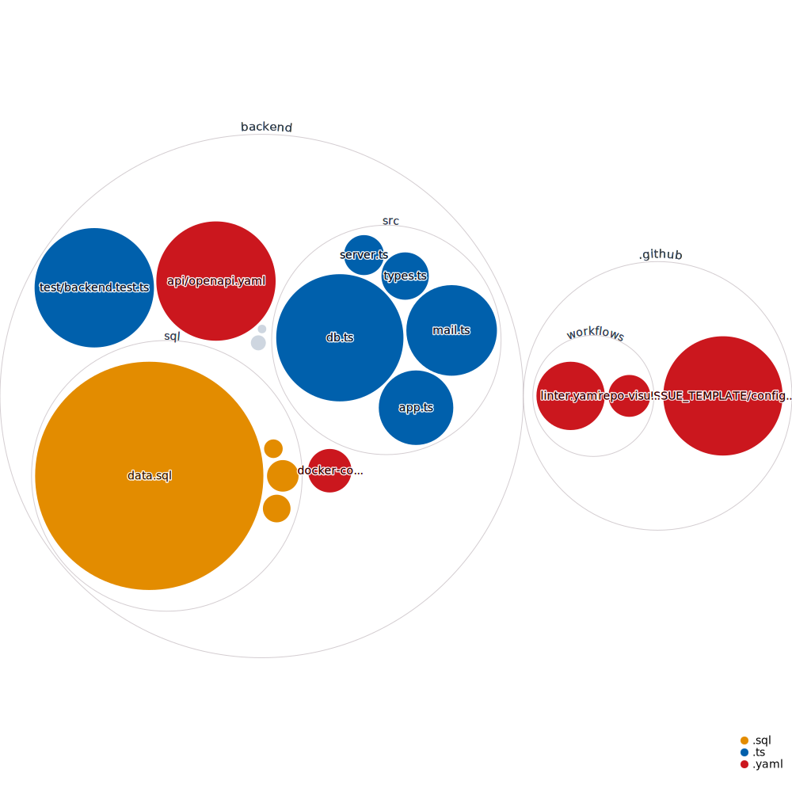

<!-- Improved compatibility of back to top link: See: https://github.com/othneildrew/Best-README-Template/pull/73 -->

<a id="readme-top"></a>

[![Contributors][contributors-shield]][contributors-url]
[![Forks][forks-shield]][forks-url]
[![Stargazers][stars-shield]][stars-url]
[![Issues][issues-shield]][issues-url]
[![MIT License][license-shield]][license-url]
[![LinkedIn][linkedin-shield]][linkedin-url]

<!-- PROJECT LOGO -->
<br />
<div align="center">
  <a href="https://github.com/blopez024/b-mail">
    
  </a>

<h3 align="center">B-Mail</h3>

  <p align="center">
    project_description
    <br />
    <a href="https://github.com/blopez024/b-mail"><strong>Explore the docs »</strong></a>
    <br />
    <br />
    <a href="https://github.com/blopez024/b-mail">View Demo</a>
    ·
    <a href="https://github.com/blopez024/b-mail/issues/new?labels=bug&template=bug-report---.md">Report Bug</a>
    ·
    <a href="https://github.com/blopez024/b-mail/issues/new?labels=enhancement&template=feature-request---.md">Request Feature</a>
  </p>
</div>

<!-- TABLE OF CONTENTS -->
<details>
  <summary>Table of Contents</summary>
  <ol>
    <li>
      <a href="#about-the-project">About The Project</a>
      <ul>
        <li><a href="#built-with">Built With</a></li>
      </ul>
    </li>
    <li>
      <a href="#getting-started">Getting Started</a>
      <ul>
        <li><a href="#prerequisites">Prerequisites</a></li>
        <li><a href="#installation">Installation</a></li>
      </ul>
    </li>
    <li><a href="#usage">Usage</a></li>
    <li><a href="#roadmap">Roadmap</a></li>
    <li><a href="#contributing">Contributing</a></li>
    <li><a href="#license">License</a></li>
    <li><a href="#contact">Contact</a></li>
    <li><a href="#acknowledgments">Acknowledgments</a></li>
  </ol>
</details>

<!-- ABOUT THE PROJECT -->

## About The Project

[![Product Name Screen Shot][product-screenshot]](https://example.com)

Here's a blank template to get started: To avoid retyping too much info. Do a search and replace with your text editor for the following: `blopez024`, `b-mail`, `twitter_handle`, `linkedin_username`, `email_client`, `email`, `project_title`, `project_description`

<p align="right">(<a href="#readme-top">back to top</a>)</p>

### Built With

- [![TypeScript][TypeScript]][TypeScript-url]
- [![Node][Node.js]][Node-url]
- [![Express][Express.js]][Express-url]
- [![Nodemon][Nodemon]][Nodemon-url]
- [![OpenAPI][OpenAPI]][OpenAPI-url]
- [![Swagger][Swagger]][Swagger-url]
- [![PostgreSQL][PostgreSQL]][PostgreSQL-url]
- [![ESLint][ESLint]][ESLint-url]
- [![PNPM][PNPM]][PNPM-url]
- [![Docker][Docker]][Docker-url]

<p align="right">(<a href="#readme-top">back to top</a>)</p>

<!-- GETTING STARTED -->

## Getting Started

This is an example of how you may give instructions on setting up your project locally.
To get a local copy up and running follow these simple example steps.

### Prerequisites

This is an example of how to list things you need to use the software and how to install them.

- pnpm
  ```sh
  pnpm install npm@latest -g
  ```

### Installation

1. Get a free API Key at [https://example.com](https://example.com)
2. Clone the repo
   ```sh
   git clone https://github.com/blopez024/b-mail.git
   ```
3. Install NPM packages
   ```sh
   npm install
   ```
4. Enter your API in `config.js`
   ```js
   const API_KEY = 'ENTER YOUR API';
   ```
5. Change git remote url to avoid accidental pushes to base project
   ```sh
   git remote set-url origin blopez024/b-mail
   git remote -v # confirm the changes
   ```

<p align="right">(<a href="#readme-top">back to top</a>)</p>

<!-- USAGE EXAMPLES -->

## Usage

Use this space to show useful examples of how a project can be used. Additional screenshots, code examples and demos work well in this space. You may also link to more resources.

_For more examples, please refer to the [Documentation](https://example.com)_

<p align="right">(<a href="#readme-top">back to top</a>)</p>

<!-- ROADMAP -->

## Roadmap

- [ ] Feature 1
- [ ] Feature 2
- [ ] Feature 3
  - [ ] Nested Feature

See the [open issues](https://github.com/blopez024/b-mail/issues) for a full list of proposed features (and known issues).

<p align="right">(<a href="#readme-top">back to top</a>)</p>

<!-- CONTRIBUTING -->

## Contributing

Contributions are what make the open source community such an amazing place to learn, inspire, and create. Any contributions you make are **greatly appreciated**.

If you have a suggestion that would make this better, please fork the repo and create a pull request. You can also simply open an issue with the tag "enhancement".
Don't forget to give the project a star! Thanks again!

1. Fork the Project
2. Create your Feature Branch (`git checkout -b feature/AmazingFeature`)
3. Commit your Changes (`git commit -m 'Add some AmazingFeature'`)
4. Push to the Branch (`git push origin feature/AmazingFeature`)
5. Open a Pull Request

<p align="right">(<a href="#readme-top">back to top</a>)</p>

### Top contributors:

<a href="https://github.com/blopez024/b-mail/graphs/contributors">
  
</a>

<!-- LICENSE -->

## License

Distributed under the MIT License. See [`LICENSE.md`](/LICENSE.md) for more information.

<p align="right">(<a href="#readme-top">back to top</a>)</p>

<!-- CONTACT -->

## Contact

Your Name - [@twitter_handle](https://twitter.com/twitter_handle) - email@email_client.com

Project Link: [https://github.com/blopez024/b-mail](https://github.com/blopez024/b-mail)

<p align="right">(<a href="#readme-top">back to top</a>)</p>

<!-- ACKNOWLEDGMENTS -->

## Acknowledgments

- []()
- []()
- []()

<p align="right">(<a href="#readme-top">back to top</a>)</p>

## Repo Hierarchy Visual



<!-- MARKDOWN LINKS & IMAGES -->
<!-- https://www.markdownguide.org/basic-syntax/#reference-style-links -->

<!-- Top Header Shields -->
<!-- Contributors -->

[contributors-shield]: https://img.shields.io/github/contributors/blopez024/b-mail.svg?style=for-the-badge
[contributors-url]: https://github.com/blopez024/b-mail/graphs/contributors

<!-- Forks -->

[forks-shield]: https://img.shields.io/github/forks/blopez024/b-mail.svg?style=for-the-badge
[forks-url]: https://github.com/blopez024/b-mail/network/members

<!-- Stars -->

[stars-shield]: https://img.shields.io/github/stars/blopez024/b-mail.svg?style=for-the-badge
[stars-url]: https://github.com/blopez024/b-mail/stargazers

<!-- Issues -->

[issues-shield]: https://img.shields.io/github/issues/blopez024/b-mail.svg?style=for-the-badge
[issues-url]: https://github.com/blopez024/b-mail/issues

<!-- License -->

[license-shield]: https://img.shields.io/github/license/blopez024/b-mail.svg?style=for-the-badge
[license-url]: https://github.com/blopez024/b-mail/blob/main/backend/LICENSE.md

<!-- Linkedin -->

[linkedin-shield]: https://img.shields.io/badge/-LinkedIn-black.svg?style=for-the-badge&logo=linkedin&colorB=555
[linkedin-url]: https://www.linkedin.com/in/blopez24/

<!-- Icon -->

[product-screenshot]: images/screenshot.png
[TypeScript]: https://img.shields.io/badge/typescript-%23007ACC.svg?style=for-the-badge&logo=typescript&logoColor=white
[TypeScript-url]: https://www.typescriptlang.org/
[Node.js]: https://img.shields.io/badge/node.js-6DA55F?style=for-the-badge&logo=node.js&logoColor=white
[Node-url]: https://nodejs.org/en
[Express.js]: https://img.shields.io/badge/express.js-%23404d59.svg?style=for-the-badge&logo=express&logoColor=%2361DAFB
[Express-url]: https://expressjs.com/
[Nodemon]: https://img.shields.io/badge/NODEMON-%23323330.svg?style=for-the-badge&logo=nodemon&logoColor=%BBDEAD
[Nodemon-url]: https://nodemon.io/
[OpenAPI]: https://img.shields.io/badge/openapi-%23000000.svg?style=for-the-badge&logo=openapiinitiative&logoColor=white
[OpenAPI-url]: https://www.openapis.org/
[Swagger]: https://img.shields.io/badge/-Swagger-%23Clojure?style=for-the-badge&logo=swagger&logoColor=white
[Swagger-url]: https://swagger.io/
[PostgreSQL]: https://img.shields.io/badge/postgresql-%23316192.svg?style=for-the-badge&logo=postgresql&logoColor=white
[PostgreSQL-url]: https://www.postgresql.org/
[ESLint]: https://img.shields.io/badge/ESLint-4B3263?style=for-the-badge&logo=eslint&logoColor=white
[ESLint-url]: https://eslint.org/
[PNPM]: https://img.shields.io/badge/pnpm-%234a4a4a.svg?style=for-the-badge&logo=pnpm&logoColor=f69220
[PNPM-url]: https://pnpm.io/
[Docker]: https://img.shields.io/badge/docker-%230db7ed.svg?style=for-the-badge&logo=docker&logoColor=white
[Docker-url]: https://www.docker.com/
